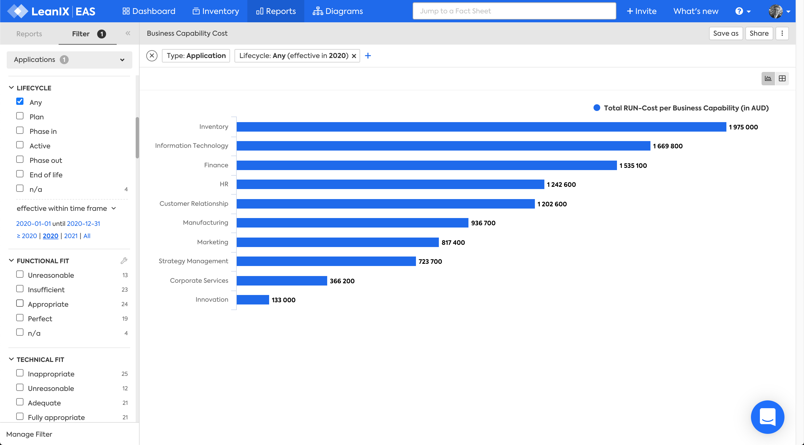

# Business Capability Cost report
## Overview

The Business Capability Cost report answers the question:

***[What is the IT spend by business capability?](../questions.md#costs)***

The costs for a Business Capability are calculated based on:

- the Applications that support the Business Capability
- the aggregate annual costs of the IT Components that implement the Application
- filtered by an Application Lifecycle that is effective within time frame or at a point of time
- filtered by any other constraints to focus on the area of interest 

*Business Capability Cost report for Applications with Any Lifecycle value effective within the 2020 timeframe*

## Requirements

### Factsheets

The following factsheets and associated properties are required:

- Business Capability
    - related to one or more Applications
- Application
    - related to one or more IT Components
- IT Component
    - Annual cost on Application - IT Component relationship

For more information, check the [report requirements in the LeanIX User Docs](https://docs.leanix.net/docs/report-overview)  

<!--
### Tags 

No tags are required for this report.
-->

### Other requirement

Overlapping dates on relationships and report date filter.
<!-- See https://docs.leanix.net/docs/insights-through-reports#knowledge-about--relations-in-eg-application-landscape -->

## Settings

This report may be displayed as a chart or a table. The table view cannot show the annual costs as they are stored on the Application - IT Component relationship.

## View

This report can be viewed as a report or a table.

*Business Capability Cost table.*

## Filters

Filters can be used to focus on the required areas and timeframes

<!--
## Editing

This report cannot be edited.
-->
