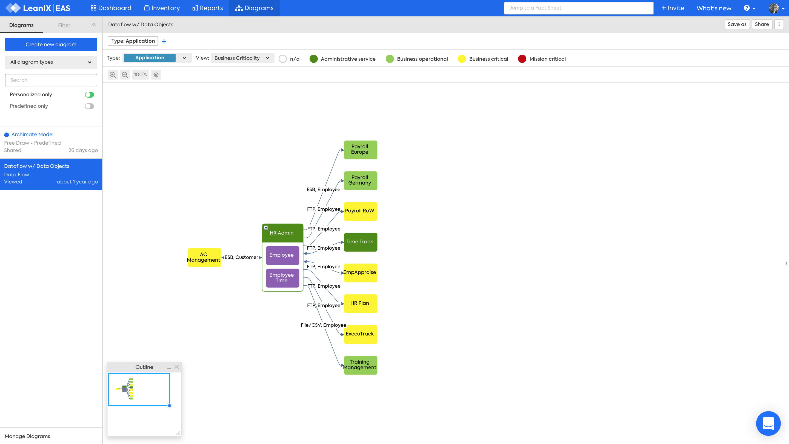
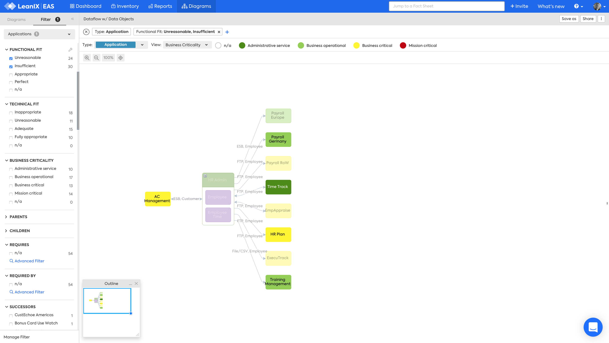

# Data Flow diagram
## Overview

The Data Flow diagram answers the question:

>How does data flow between applications?

[Read about creating Data Flow diagrams](https://docs.leanix.net/docs/integration-architecture#dive-into-details---data-flow-diagram) in the LeanIX documentation. 

*Data Flow diagram, Business Criticality view*

## Requirements

The following related factsheets and associated properties are required:

- Application
- Interface
- Data
- IT Component

Other factsheets may be required to display related factsheets on the diagram 

## Views

The views available are based on the Application factsheet:

#### Fields on the factsheet 

1. [Lifecycle][lifecycle-view]
1. [Application Functional Fit][application-functional-fit-view]
1. [Application Technical Fit][application-technical-fit-view]
1. [Application Business Criticality][application-business-criticality-view]

#### Fields on relations

1. [IT Components: Total annual cost][application-total-annual-cost-view]

#### Fields on related factsheets

1. [Aggregated Obsolescence Risk][aggregated-obsolescence-risk-view]
1. [Data Classification][data-classification-view]
1. [IT Component Technical Fit][application-technical-fit-view]
1. [Project Risk][project-risk-view]
1. [Project Status][project-status-view]
1. [Project Business Value][project-busiess-value-view]

#### Tags

You can colour factsheets based on tags. [Tag colors](https://docs.leanix.net/docs/maintain-your-tags) are defined by your LeanIX Administrator

## Filters

[Use filters][report-filters] to focus on the specific parts of the diagram by fading out certain factsheets.

*Data Flow diagram, Filtered view*

<!-- view links -->

[lifecycle-view]: https://docs.leanix.net/docs/reporting-views#1-lifecycle
[application-functional-fit-view]: https://docs.leanix.net/docs/reporting-views#2-functional-fit
[application-technical-fit-view]: https://docs.leanix.net/docs/reporting-views#3-technical-fit
[it-component-technical-fit]: https://docs.leanix.net/docs/reporting-views#3-technical-fit
[application-business-criticality-view]: https://docs.leanix.net/docs/reporting-views#4-business-criticality
[aggregated-obsolescence-risk-view]: https://docs.leanix.net/docs/reporting-views#5-technology-risk
[project-risk-view]: https://docs.leanix.net/docs/reporting-views#6-project-risk
[project-status-view]: https://docs.leanix.net/docs/reporting-views#7-project-status
[project-cost-view]: https://docs.leanix.net/docs/reporting-views#8-project-business-value-budget-opex--capex
[project-business-value-view]: https://docs.leanix.net/docs/reporting-views#9-project-business-value-npv
[provider-quality-view]: https://docs.leanix.net/docs/reporting-views#10-provider-quality
[provider-criticality-view]: https://docs.leanix.net/docs/reporting-views#11-provider-criticality
[application-total-annual-cost-view]: https://docs.leanix.net/docs/reporting-views#12-it-componentsapplications-total-annual-cost
[it-component-resource-classification]: https://docs.leanix.net/docs/reporting-views#13-technical-stacksit-components-resource-classification
[data-classification-view]: https://docs.leanix.net/docs/reporting-views#14-data-object-application-data-classification

<!-- other links -->

[report-filters]: https://docs.leanix.net/docs/searching-and-filtering-functions-in-leanix#searching-in-reports
