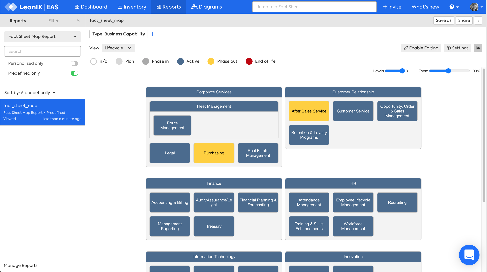

??? note "Work in progress"
    - retain Filter section?

# Business Capability Factsheet Map report

The Business Capability Factsheet Map report answers the question:

***[What business capabilities support our business?](../questions.md#business-capabilities)***

*Factsheet Map Report for Business Capabilities, Lifecycle view, Wrapped layout, Editing enabled.*

## Requirements

### Factsheets

The following factsheets and associated properties are required:

- Business Capability

### Tags 

No tags are required for this report

### Other requirement

No other requirements

## Settings

**Factsheet type** choose Business Capability

**Wrap layout** to display the report within the width of the window to avoid horizontal scrolling

## View

The views available will vary based on the chosen factsheet type. There are three types of views, based on: 

1. fields on the factsheet 
2. fields on related factsheets
3. tags

### Fields on the factsheet 

1. Lifecycle

### Fields on related factsheets

1. Project Risk
1. Project Status
1. Project Business Values
1. Application Functional Fit
1. Application Technical Fit
1. Application Business Criticality

### Tags

As your LeanIX Administrator has defined for the Business Capability factsheet

## Filters

Filters can be used to focus on the required Business Capabilities

## Editing

Editing can be enabled in the report allowing you to move, remove or add factsheets. These changes are made to the Inventory, not just visually in the report.
