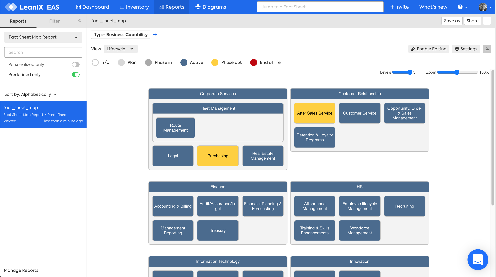
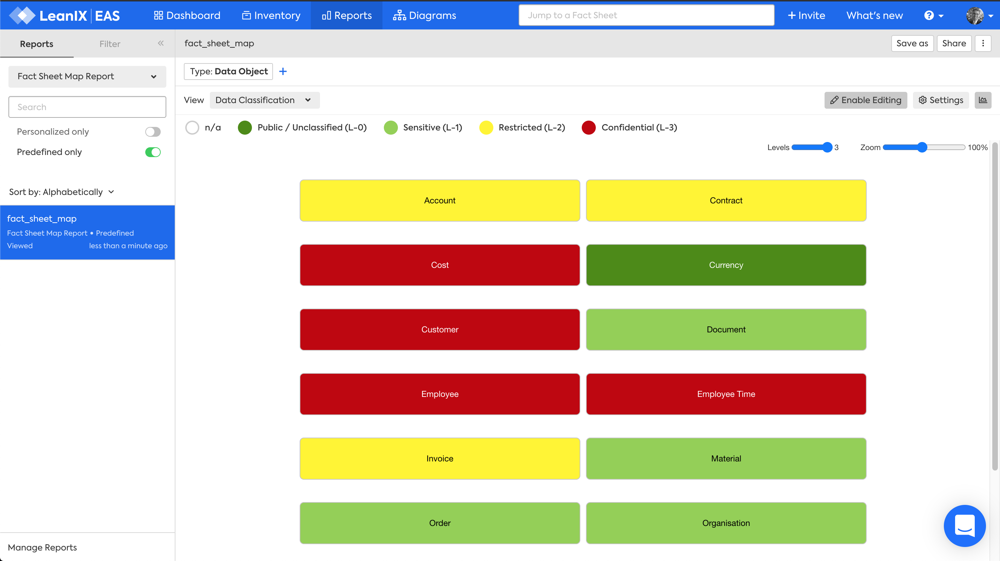
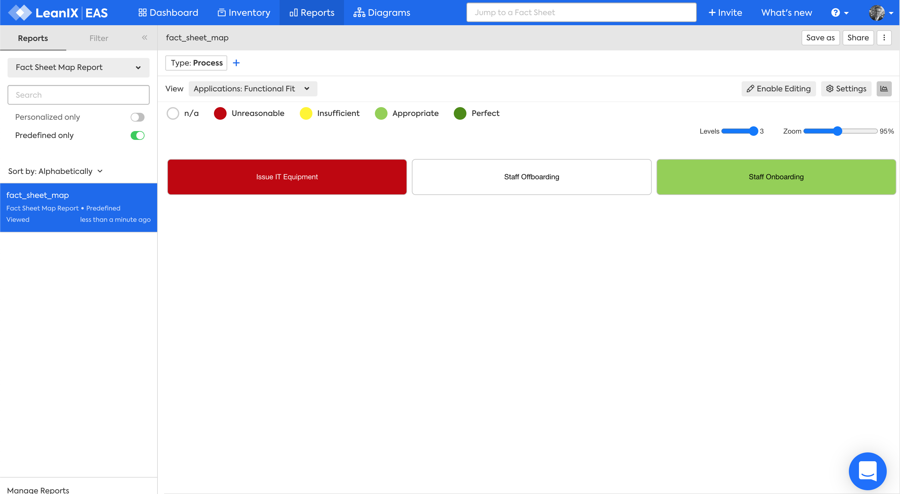

# Factsheet Map Reports
## Overview

The Factsheet Map report shows a hierarchy for one factsheet type. 

There are five reports: 

- [Business Capability Map](#business-capability) - *What business capabilities support our business?* 
- [Data Object Map](#data-object) - *What data objects do we manage?*
- [Process Map](#process) - *What processes support our business?*
- [Technical Stack Map](#technical-stack) - *What is the technical stack used to classify our IT components?*
- [User Group Map](#user-group) - *What user groups are part of, or interact with, our business?*

:material-arrow-down-circle: The Factsheet Map report is a custom LeanIX report available in the [LeanIX Store](https://store.leanix.net/en/report-details/f7fd185e-10a5-4496-affe-8884f54de96d/749ef021-c59a-4fd1-8ae6-65e05dcf9bbd).

---

## Business Capability 

The Business Capability Factsheet Map report answers the question:

***[What business capabilities support our business?](../questions.md#business-capabilities)***

*Factsheet Map Report for Business Capabilities, Lifecycle view, Wrapped layout, Editing enabled.*

### Requirements

#### Factsheets

The following factsheets and associated properties are required:

- Business Capability

#### Tags 

- No tags are required for this report

#### Other requirement

- No other requirements

### Settings

- Factsheet type -  choose Business Capability
-Wrap layout -  to display the report within the width of the window to avoid horizontal scrolling

### View

The views available will vary based on the chosen factsheet type. Choose from:

##### Fields on the factsheet 

1. Lifecycle

##### Fields on related factsheets

1. Project Risk
1. Project Status
1. Project Business Values
1. Application Functional Fit
1. Application Technical Fit
1. Application Business Criticality

##### Tags

As your LeanIX Administrator has defined for the Business Capability factsheet

### Filters

Filters can be used to focus on the required Business Capabilities

### Editing

Editing can be enabled in the report allowing you to move, remove or add factsheets. These changes are made to the Inventory, not just visually in the report.

---

## Data Object  

The Data Object Factsheet Map report answers the question:

***[What data objects do we manage?](../questions.md#data)***

*Factsheet Map report for Data Objects, Data Classification view, Wrapped layout.*

### Requirements

#### Factsheets

The following factsheets and associated properties are required:

- Data Object

#### Tags 

- No tags are required for this report.

#### Other requirement

- No other requirements

### Settings

- Factsheet type - choose Data Object

- Wrap layout -  to display the report within the width of the window to avoid horizontal scrolling

### View

The views available will vary based on the chosen factsheet type. Choose from: 

##### Fields on the factsheet 

1. Lifecycle
1. Data Classification

##### Fields on related factsheets

1. Application Functional Fit
1. Application Technical Fit
1. Application Business Criticality

##### Tags

As your LeanIX Administrator has defined for the Data Object factsheet

### Filters

Filters can be used to focus on the required Data Object

### Editing

Editing can be enabled in the report allowing you to move, remove or add factsheets. These changes are made to the Inventory, not just visually in the report.

---

## Process 

The Process Factsheet Map report answers the question:

***[What processes support our business?](../questions.md#process)***

*Factsheet Map Report for Process, Lifecycle view.*

### Requirements

#### Factsheets

The following factsheets and associated properties are required:

- Process

#### Tags 

- No tags are required for this report.

#### Other requirement

- No other requirements

### Settings

- Factsheet type - choose Process

- Wrap layout -  to display the report within the width of the window to avoid horizontal scrolling

### View

The views available will vary based on the chosen factsheet type. Choose from:

##### Fields on the factsheet 

1. Lifecycle

##### Fields on related factsheets

1. Project Risk
1. Project Status
1. Project Business Values
1. Application Functional Fit
1. Application Technical Fit
1. Application Business Criticality

##### Tags

As your LeanIX Administrator has defined for the Process factsheet

### Filters

Filters can be used to focus on the required Business Capabilities

### Editing

Editing can be enabled in the report allowing you to move, remove or add factsheets. These changes are made to the Inventory, not just visually in the report.

---

## Technical Stack 

The Technical Stack Factsheet Map report answers the question:

***[What Technical Stacks classify our IT Components?](../questions.md#technical-stack)***

*Factsheet Map report for Technical Stack, IT Component Resource Classification view, Wrapped layout.*

### Requirements

#### Factsheets

The following factsheets and associated properties are required:

- Technical Stack

#### Tags 

- No tags are required for this report.

#### Other requirement

- No other requirements

### Settings

- Factsheet type - choose Technical Stack

- Wrap layout -  to display the report within the width of the window to avoid horizontal scrolling

### View

The views available will vary based on the chosen factsheet type. Choose from:

##### Fields on the factsheet 

- Lifecycle

##### Fields on relations 

- IT Component Resource Classification

##### Fields on related factsheets

- IT Component Technical Fit

### Filters

Filters can be used to focus on the required Technical Stack categories.

### Editing

Editing can be enabled in the report allowing you to move, remove or add factsheets. These changes are made to the Inventory, not just visually in the report.

---

## User Group  

The User Group Factsheet Map report answers the question:

***[What User Groups are part of, or interact with, our business?](../questions.md#user-groups)***

*Factsheet Map report for User Group, Lifecycle view, Wrapped layout.*

### Requirements

#### Factsheets

The following factsheets and associated properties are required:

- User Group

#### Tags 

- No tags are required for this report.

#### Other requirements

- No other requirements

### Settings

- Factsheet type - choose User Group

- Wrap layout -  to display the report within the width of the window to avoid horizontal scrolling

### View

The views available will vary based on the chosen factsheet type. Choose from:

##### Fields on the factsheet 

1. Lifecycle

##### Fields on related factsheets

1. Application Functional Fit
1. Application Technical Fit
1. Application Business Criticality
1. IT Component Technical Fit
1. Project Risk
1. Project Status
1. Project Business Values

##### Tags

As your LeanIX Administrator has defined for the User Group factsheet

### Filters

Filters can be used to focus on the required Business Capabilities

### Editing

Editing can be enabled in the report allowing you to move, remove or add factsheets. These changes are made to the Inventory, not just visually in the report.
