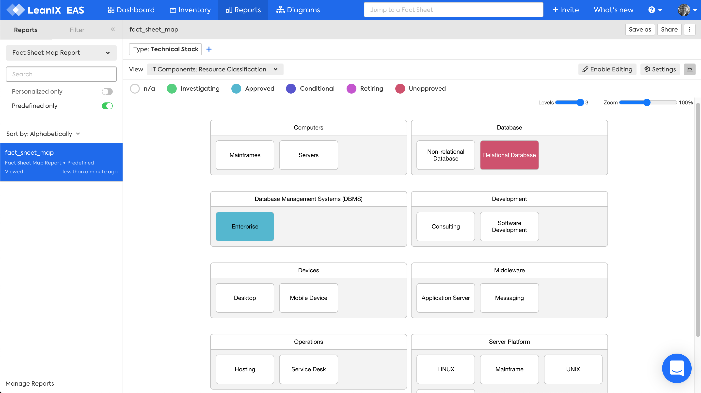

??? note "Work in progress"
    - missing image 
    - correct link to question
    - retain Filter section?

# Technical Stack Factsheet Map report

The Technical Stack Factsheet Map report answers the question:

***[What Technical Stacks classify our IT Components?](../questions.md#technical-stack)***

*Factsheet Map report for Technical Stack, IT Component Resource Classification view, Wrapped layout.*

## Requirements

### Factsheets

The following factsheets and associated properties are required:

- Technical Stack

### Tags 

No tags are required for this report.

### Other requirement

No other requirements

## Settings

**Factsheet type** choose Technical Stack

**Wrap layout**  to display the report within the width of the window to avoid horizontal scrolling

## View

The views available will vary based on the chosen factsheet type. There are three types of views, based on: 

1. fields on the factsheet 
1. fields on relations
1. fields on related factsheets

### Fields on the factsheet 

- Lifecycle

### Fields on relations 

- IT Component Resource Classification

### Fields on related factsheets

- IT Component Technical Fit

## Filters

Filters can be used to focus on the required Technical Stack categories.

## Editing

Editing can be enabled in the report allowing you to move, remove or add factsheets. These changes are made to the Inventory, not just visually in the report.
