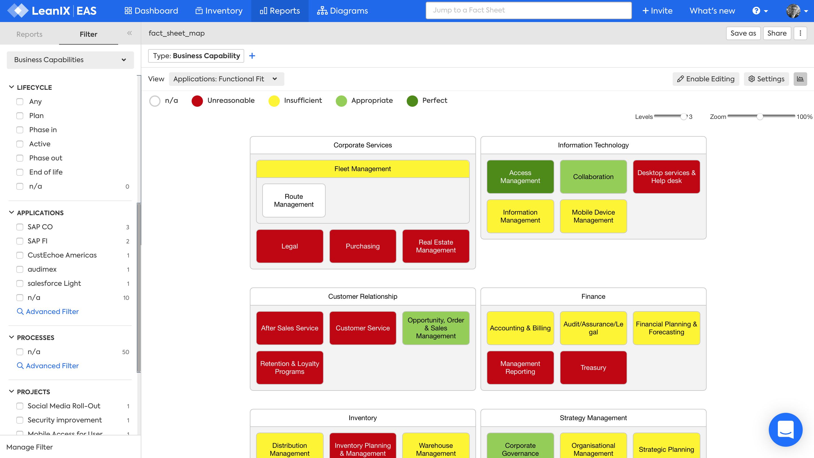
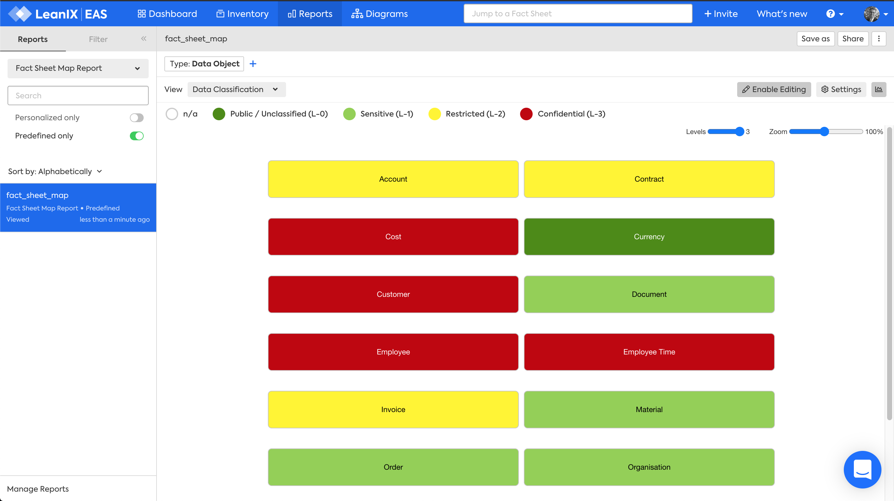
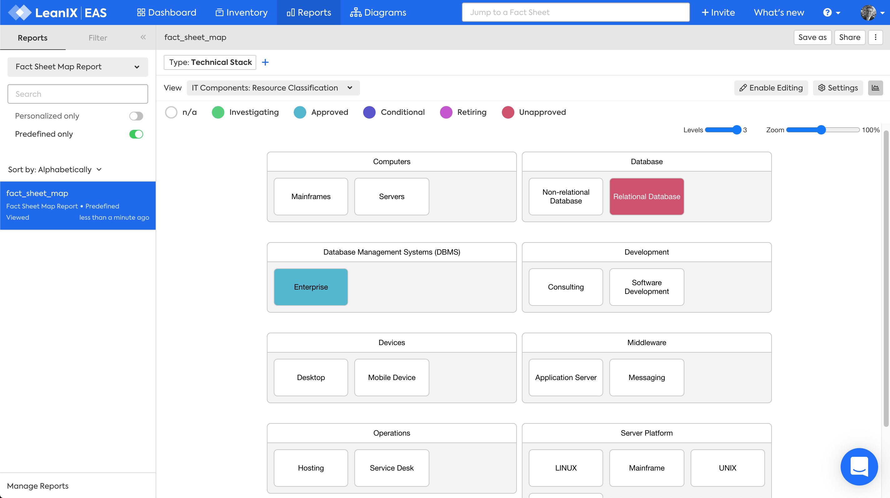

# Factsheet Map

## Overview

The Factsheet Map shows a hierarchy of one factsheet type. 

The Factsheet Map can be displayed as a:

- [Business Capability Map](#business-capability) - How are business capabilities grouped?
- [Data Object Map](#data-object) - How are data objects grouped?
- [Process Map](#process) - How are processes grouped?
- [Technical Stack Map](#technical-stack) - How are technology categories grouped?
- [User Group Map](#user-group) - How are user groups organised in a hierarchy?

:material-arrow-down-circle:{: .store } The Factsheet Map is a custom LeanIX report available in the [LeanIX Store](https://store.leanix.net/en/report-details/f7fd185e-10a5-4496-affe-8884f54de96d/749ef021-c59a-4fd1-8ae6-65e05dcf9bbd).

---

## Business Capability 

The Business Capability Factsheet Map answers the question:

> What business capabilities support our business?

*Factsheet Map for Business Capabilities, Lifecycle view, Wrapped layout, Editing enabled.*

### Requirements

#### Factsheets

The following factsheets and associated properties are required:

- Business Capability

<!--
#### Tags 

- No tags are required for this report

#### Other requirement

- No other requirements
-->

### Settings

- Factsheet type -  choose Business Capability
- Wrap layout -  to display the map within the width of the window to avoid horizontal scrolling

### View

The views available will vary based on the chosen factsheet type. Choose from:

##### Fields on the factsheet 

1. Lifecycle

##### Fields on related factsheets

1. Project Risk
1. Project Status
1. Project Business Values
1. Application Functional Fit
1. Application Technical Fit
1. Application Business Criticality

##### Tags

As your LeanIX Administrator has defined for the Business Capability factsheet

### Filters

Use filters to focus on the required Business Capabilities

### Editing

Enable editing to allow you to move, remove or add factsheets. These changes are made to the Inventory, not just visually in the report.

---

## Data Object  

The Data Object Factsheet Map answers the question:

> What data objects do we manage?

*Factsheet Map for Data Objects, Data Classification view, Wrapped layout.*

### Requirements

#### Factsheets

The following factsheets and associated properties are required:

- Data Object

<!--
#### Tags 

- No tags are required for this report

#### Other requirement

- No other requirements
-->

### Settings

- Factsheet type - choose Data Object

- Wrap layout -  to display the report within the width of the window to avoid horizontal scrolling

### View

The views available will vary based on the chosen factsheet type. Choose from: 

##### Fields on the factsheet 

1. Lifecycle
1. Data Classification

##### Fields on related factsheets

1. Application Functional Fit
1. Application Technical Fit
1. Application Business Criticality

##### Tags

As your LeanIX Administrator has defined for the Data Object factsheet

### Filters

Use filters to focus on the required Data Object

### Editing

Enable editing to allow you to move, remove or add factsheets. These changes are made to the Inventory, not just visually in the report.

---

## Process 

The Process Factsheet Map answers the question:

> What processes support our business?

*Factsheet Map for Processes, Lifecycle view.*

### Requirements

#### Factsheets

The following factsheets and associated properties are required:

- Process

<!--
#### Tags 

- No tags are required for this report

#### Other requirement

- No other requirements
-->

### Settings

- Factsheet type - choose Process

- Wrap layout -  to display the report within the width of the window to avoid horizontal scrolling

### View

The views available will vary based on the chosen factsheet type. Choose from:

##### Fields on the factsheet 

1. Lifecycle

##### Fields on related factsheets

1. Project Risk
1. Project Status
1. Project Business Values
1. Application Functional Fit
1. Application Technical Fit
1. Application Business Criticality

##### Tags

As your LeanIX Administrator has defined for the Process factsheet

### Filters

Use filters to focus on the required Business Capabilities

### Editing

Enable editing to allow you to move, remove or add factsheets. These changes are made to the Inventory, not just visually in the report.

---

## Technical Stack 

The Technical Stack Factsheet Map answers the question:

>What Technical Stacks classify our IT Components?]

*Factsheet Map for Technical Stack, IT Component Resource Classification view, Wrapped layout.*

### Requirements

#### Factsheets

The following factsheets and associated properties are required:

- Technical Stack

<!--
#### Tags 

- No tags are required for this report

#### Other requirement

- No other requirements
-->

### Settings

- Factsheet type - choose Technical Stack

- Wrap layout -  to display the report within the width of the window to avoid horizontal scrolling

### View

The views available will vary based on the chosen factsheet type. Choose from:

##### Fields on the factsheet 

- Lifecycle

##### Fields on relations 

- IT Component Resource Classification

##### Fields on related factsheets

- IT Component Technical Fit

### Filters

Use filters to focus on the required Technical Stack categories.

### Editing

Enable editing to allow you to move, remove or add factsheets. These changes are made to the Inventory, not just visually in the report.

---

## User Group  

The User Group Factsheet Map answers the question:

>What User Groups are part of, or interact with, our business?

*Factsheet Map for User Group, Lifecycle view, Wrapped layout.*

### Requirements

#### Factsheets

The following factsheets and associated properties are required:

- User Group

<!--
#### Tags 

- No tags are required for this report

#### Other requirement

- No other requirements
-->

### Settings

- Factsheet type - choose User Group

- Wrap layout -  to display the report within the width of the window to avoid horizontal scrolling

### View

The views available will vary based on the chosen factsheet type. Choose from:

##### Fields on the factsheet 

1. Lifecycle

##### Fields on related factsheets

1. Application Functional Fit
1. Application Technical Fit
1. Application Business Criticality
1. IT Component Technical Fit
1. Project Risk
1. Project Status
1. Project Business Values

##### Tags

As your LeanIX Administrator has defined for the User Group factsheet

### Filters

Use filters to focus on the required Business Capabilities

### Editing

Enable editing to allow you to move, remove or add factsheets. These changes are made to the Inventory, not just visually in the report.
