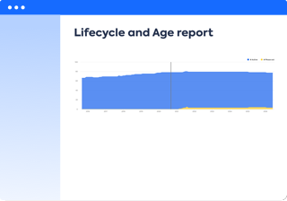

 
# LeanIX Report Gallery

**[Discover the questions you can answer using LeanIX reports][questions]**

Choose a report below to learn the questions it answers and how to create it using the [LeanIX Enterprise&nbsp;Architecture&nbsp;Suite](https://www.leanix.net/en/solutions/enterprise-architecture-suite).

## Types of Reports

The **[Inventory][inventory]** shows a table of factsheets and their properties.

[][inventory]

**[Factsheet Map reports][factsheet-map]** show a hierarchy of business capabilities, data objects, processes, technology stack categories, or user groups.

[][factsheet-map]

**[Business Capability Map][business-capability-map]** show a hierarchy of business capabilities and how they change over time.

[][business-capability-map]

**[Landscape reports][landscape]** show one factsheet type within the hierarchy of another. 

[][landscape]

**[Matrix reports][matrix]** show one factsheet type within a matrix of two other factsheet types or time.

[][matrix]

**[Roadmap reports][roadmap]** show the lifecycle of applications, IT components, projects or transformation items. 

[][roadmap]

The **[Interface Circle Map][interface]** shows a high-level view of interfaces between applications.

[][interface]

**[Data Flow diagrams][data-flow]** show interfaces between selected applications.

[][data-flow]

**[World Maps][location]** show a geographic map of user groups or IT component locations.

[][location]

**[Cost reports][cost]** total costs associated with business capabilities, providers, projects, transformation items or objectives.

[][cost]

**[Portfolio reports][portfolio]** show a grid of applications, providers, projects, transformation items plotted against two criteria.

[][portfolio]

**[Lifecycle and Age reports][lifecycle-age]** show the number of applications added or removed from the portfolio over time.

[][lifecycle-age]

## Using LeanIX Reports

Get a refresher on [using LeanIX reports](https://docs.leanix.net/docs/insights-through-reports) from the LeanIX User Documentation.

<!-- links -->
[questions]: questions.md 
[factsheet-map]: factsheet-map/ "Factsheet maps"
[business-capability-map]: business-capability-map/ "Business Capability map"
[landscape]: landscape/ "Landscape reports"
[matrix]: matrix/ "Matrix reports"
[roadmap]: roadmap/ "Roadmap reports"
[location]: location/ "World maps"
[interface]: interface/ "Interface Circle map"
[data-flow]: dataflow/ "Data Flow diagram"
[cost]: cost/ "Cost reports"
[lifecycle-age]: metrics/lifecycle-and-age-report "Lifecycle and Age reports"
[portfolio]: metrics/ "Portfolio reports"
[inventory]: inventory/ "Inventory"
