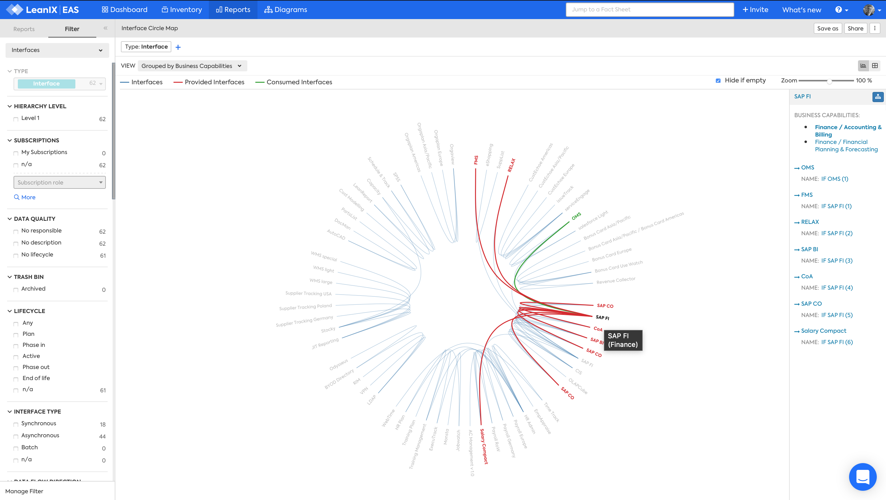

# Interface Circle Map

## Overview 

The **Interface Circle Map** answers the question:

>Which applications provide or consume interfaces?

  

*Interface Circle Map, Applications not providing or consuming interfaces are hidden.*

!!! tip
    You can select an application in the Interface Circle Map and then press the :fontawesome-solid-sitemap:{: .leanix }  button to automatically generate a Data Flow diagram for that application. [Learn more...](https://docs.leanix.net/docs/integration-architecture#use-the-interface-circle-map-to-get-a-high-level-overview)

## Requirements

The following factsheets and associated properties are required:

- Application
- Interface
- Data
- IT Component

## Settings

Display this report as a map or a table.

## View

Applications can be arranged Alphabetically or Grouped by Business Capability.

Applications that don't provide or consume interfaces can be hidden on the map.

## Filters

[Use filters][report-filters] to focus on the required Interfaces

<!-- other links -->

[report-filters]: https://docs.leanix.net/docs/searching-and-filtering-functions-in-leanix#searching-in-reports
