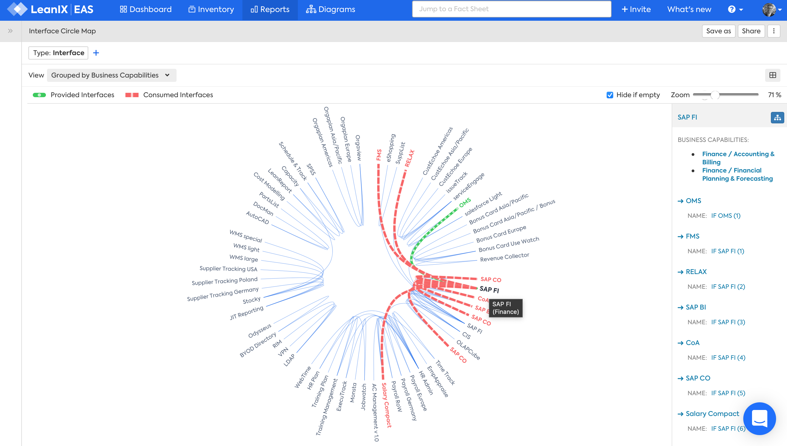

??? note "Work in progress"
    - See [LeanIX Docs](https://docs.leanix.net/docs/integration-architecture#use-the-interface-circle-map-to-get-a-high-level-overview)
    - https://docs.leanix.net/docs/interfaces-modeling

# Interface Circle Map

## Overview 

The Interface Circle Map answers the question:

>Which applications provide or consume interfaces?

  

*Interface Circle Map, Applications not providing or consuming interfaces are hidden.*

:fontawesome-regular-check-circle:{: .check-circle } The Interface Circle Map is a standard LeanIX report.

## Requirements

### Factsheets

The following factsheets and associated properties are required:

- Application
- Interface
- Data
- IT Component

<!--
#### Tags 

- No tags are required for this report

#### Other requirements

- No other requirements
-->

## Settings

Display this report as a map or a table.

## View

Applications can be arranged Alphabetically or Grouped by Business Capability.

Applications that don't provide or consume interfaces can be hidden on the map.

<!--
### Tags

No tags are required for this report.
-->

## Filters

Use filters to focus on the required Interfaces

<!--
## Editing

This report cannot be edited.
->
