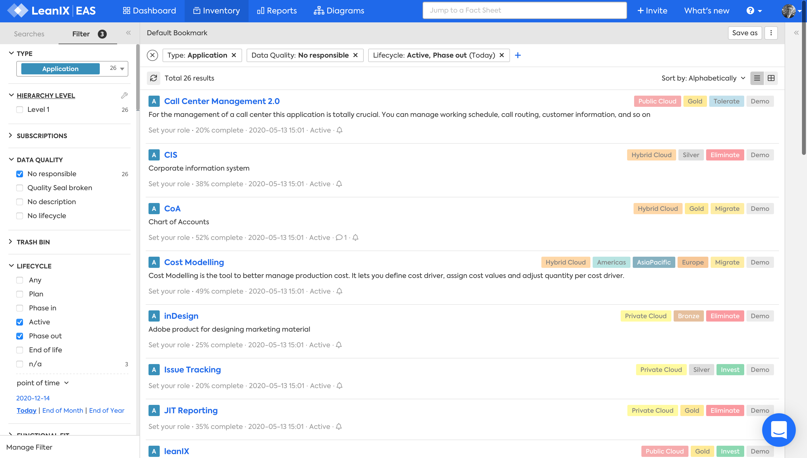

# Inventory 

The **Inventory** answers the questions:

>- What user groups are part of, or interact with, our organisation?
- What business capabilities support our organisation?
- What processes do we perform?
- What applications do we have?
- What data objects do we use?
- What interfaces do we use?
- What projects do we have?
- What IT components do we have?
- What technology categories do we use to classify IT components?
- What providers do we use?
- What transformation items are we planning?[^1]
- What objectives are we working towards?[^1]

 

Figure: Inventory, filtered by factsheet type, missing Responsility property, and lifecycle status.

The Inventory shows a table of information about one or more factsheet types.

## Filters

[Use filters][inventory-filters] to focus on the required factsheets

<!-- links -->

[inventory-filters]: https://docs.leanix.net/docs/find-factsheets-in-the-inventory#search-filter-and-find

[^1]: Requires  the LeanIX Enterprise Architecture Suite - [Business Transformation Management module](https://www.leanix.net/en/business-transformation).
