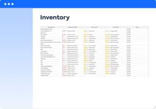

??? note "Work in progress"
    - Should we on all report index pages include use cases, or just stick to links to underlying reports?
    - Should we include this? Not a report but does answer basic questions, e.g.
      - subscription
      - data classification

# Inventory 

The Inventory shows a table of information about one or more factsheet types. 

 

<!-- 
{: align=left }
-->

The Inventory answers the questions:

- What user groups are part of, or interact with, our organisation?
- What business capabilities support our organisation?
- What processes do we perform?
- What applications do we have?
- What data objects do we use?
- What interfaces do we use?
- What projects do we have?
- What IT components do we have?
- What technology categories do we use to classify IT components?
- What providers do we use?
