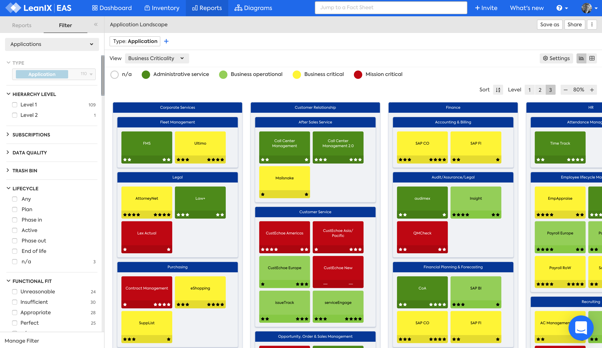
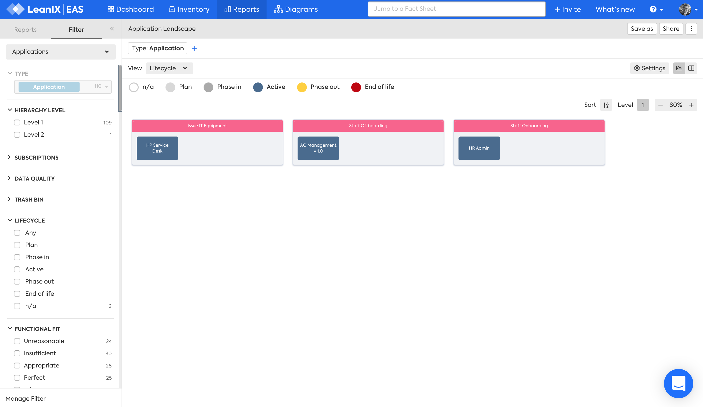

??? note "Work in progress"
    - Missing links
    - Missing image and caption

# Application Landscape report

## Overview

The Application Landscape report answers the questions:

>- What Applications support Business Capabilities?
>- What Applications support Processes?
>- What Applications support User Groups?

The report shows Applications, within a hierarchy of either, 

- [Business Capabilities](#business-capability)
- [Processes](#process)
- [User Groups](#user-group)

--- 

## Business Capability

This report answers the question:

- *[What Applications support Business Capabilities?](../questions/#business-capability)*

This is useful for... 

*Caption.*

### Requirements

#### Factsheets

Specific factsheets and associated properties are required:

- Business Capability 
- Application
    - Application - Business Capability relationship
    
#### Tags 

Specific tags are required for this report.

#### Other requirements

No other requirements

### Settings

Specific settings for this report 

### View

Specific view available are: 

- A Plan view is available with the LeanIX [Business Transformation Management module](https://www.leanix.net/en/business-transformation) to show "To-Be" states if the Plan was executed

--- 

## Process
This report answers the question:

- *[What Applications support Process?](../questions/#process)*

This is useful specifically for... 

*Caption.*

### Requirements

#### Factsheets

Specific factsheets and associated properties are required:

- Process 
- Application
    - Application - Process relationship
    
#### Tags 

Specific tags are required for this report.

#### Other requirements

No other requirements

### Settings

Specific settings for this report 

### View

Specific view available are: 

- A Plan view is available with the LeanIX [Business Transformation Management module](https://www.leanix.net/en/business-transformation) to show "To-Be" states if the Plan was executed

--- 

## User Group 

This report answers the question:

- *[What Applications support User Groups?](../questions/#user-groups)*

This is useful specifically for... 

*Caption.*

### Requirements

#### Factsheets

Specific factsheets and associated properties are required:

- User Group 
- Application
    - Application - User Group relationship

#### Tags 

Specific tags are required for this report.

#### Other requirements

No other requirements

### Settings

Specific settings for this report 

### View

Specific view available are: 

- A Plan view is available with the LeanIX [Business Transformation Management module](https://www.leanix.net/en/business-transformation) to show "To-Be" states if the Plan was executed
