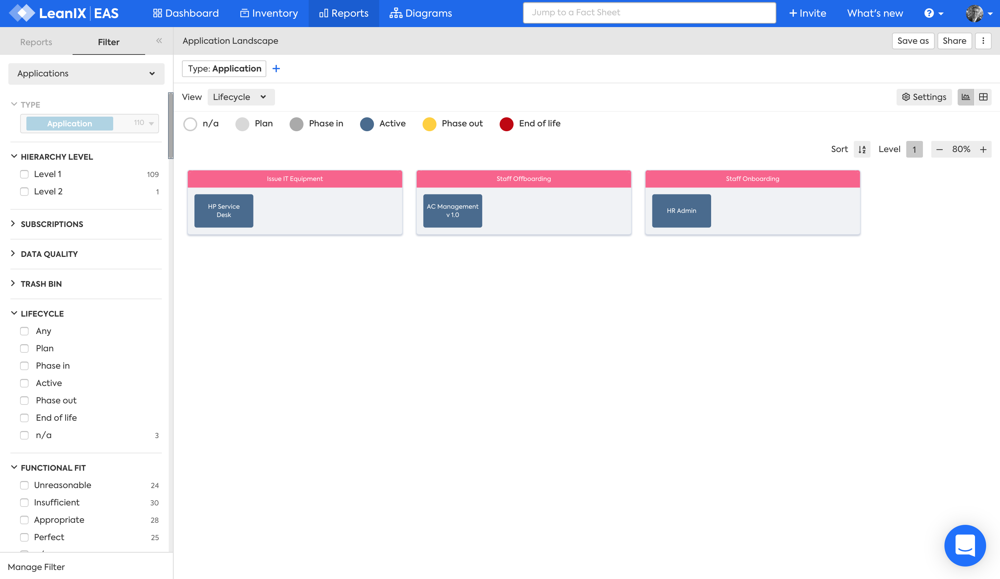
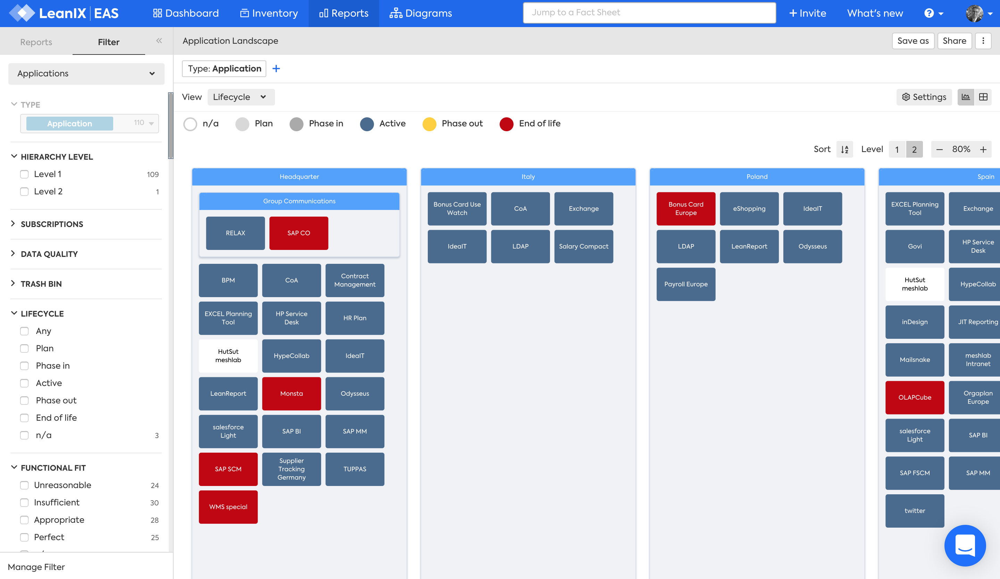

??? note "Work in progress"
    - Report in development by LeanIX

# Process Landscape reports

## Overview

The Process Landscape report answers the questions:

>- What Processes use Business Capabilities?
>- What Processes are used by  Processes?
>- What Processes are used by  User Groups?

There are three Process Landscape reports that show the processes, within a hierarchy of:

- [Applications](#applications) 
- [Business Capabilities](#business-capability)
- [User Groups](#user-group)

*Process Landscape for Applications.*

--- 

## Business Capability

This report answers the question:

- *[What Applications support Business Capabilities?](../questions/#business-capability)*

*Caption.*

### Requirements

Specific factsheets and associated properties are required:

- Business Capability 
- Process
    - Process - Business Capability requires relationship

<!--    
#### Tags 

Specific tags are required for this report.

#### Other requirements

No other requirements
-->

### Settings

Specific settings for this report 

### View

Specific view available are: 

### Filters

Use filters to focus on the required Business Capabilities.

--- 

## Process
This report answers the question:

- *[What Applications support Process?](../questions/#process)*

This is useful specifically for... 

*Caption.*

### Requirements

Specific factsheets and associated properties are required:

- Process 
- Application
    - Application - Process relationship

### Settings

Specific settings for this report 

### View

Specific view available are: 

### Filters

Use filters to focus on the required Processes.

--- 

## User Group 

This report answers the question:

- *[What Applications support User Groups?](../questions/#user-groups)*

This is useful specifically for... 

*Caption.*

### Requirements

Specific factsheets and associated properties are required:

- User Group 
- Application
    - Application - User Group relationship

### Settings

Specific settings for this report 

### View

Specific view available are: 

### Filters

Use filters to focus on the required User Groups.
