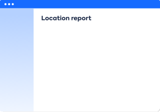

!!! note "Work in progress"

# About Location reports

Location reports show a geographic map overlaid (by Country or location) associated with either the User Group or IT Component.

 

There are three reports: 

- [Application Sourcing](application-sourcing-report.md) - *What is the question?*
- [Application Usage](application-usage-report.md) - *What, and how many, Applications do User Groups in this location use?*
- [IT Component Location](it-component-location-report.md) - *Where are IT Components located?*

:fontawesome-regular-check-circle:{: .check-circle }  Location reports are LeanIX standard reports.
