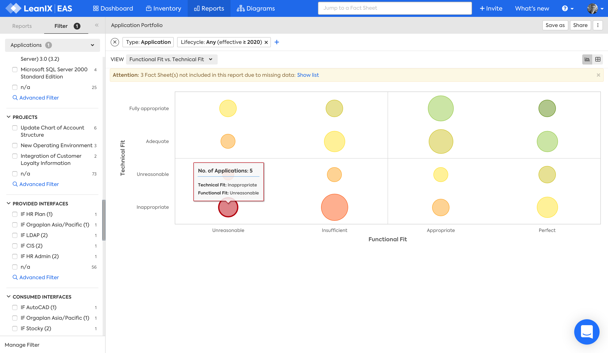

# Application Portfolio report

## Overview

The Application Portfolio report answers the question:

>Which applications need investment or replacement?

- Applications with both low Functional Fit and Technical Fit may need to be replaced
- Applications with low Functional Fit but high Business Criticality may need investment
- Applications with low Technical Fit but high Business Criticality may need investment

  

*Application Portfolio report, Functional Fit vs. Technical Fit view.*

## Requirements

The following factsheets and associated properties are required:

- Application
    - Functional Fit
    - Technical Fit
    - Business Criticality

## Settings

Display this report as a chart or table. 

  

## View

The views available are:

1. Functional Fit vs. Technical Fit 
1. Functional Fit vs. Business Criticality 
1. Technical Fit vs. Business Criticality 
## Filters

[Use filters][report-filters] to focus on the required factsheets.

<!-- links -->

[report-filters]: https://docs.leanix.net/docs/searching-and-filtering-functions-in-leanix#searching-in-reports
