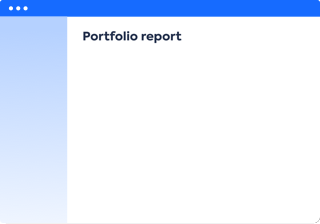
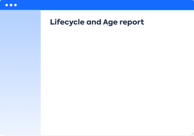

!!! note "Work in progress"

# About Metrics reports

The Metrics reports show...

[][portfolio]
[][lifecycle-age]

<!--

-->

There are four types of reports:

1. [Application Portfolio](application-portfolio-report.md) - *Which applications need investment or replacement?*
1. [Project Portfolio](project-portfolio-report.md) - *What is the question about risk and value?*
1. [Provider Portfolio](provider-portfolio-report.md) - *What is the question about criticality and quality?*
1. [Lifecycle and Age](lifecycle-and-age-report.md) 
    - *How many Applications are Active or being Phased out each month?*
    - *How many Applications became Active each year?*

:fontawesome-regular-check-circle:{: .check-circle }  Metrics reports are standard LeanIX reports.

<!-- links -->

[portfolio]: application-portfolio-report.md "Portfolio reports"
[lifecycle-age]: lifecycle-and-age-report.md "Lifecycle and Age reports"
