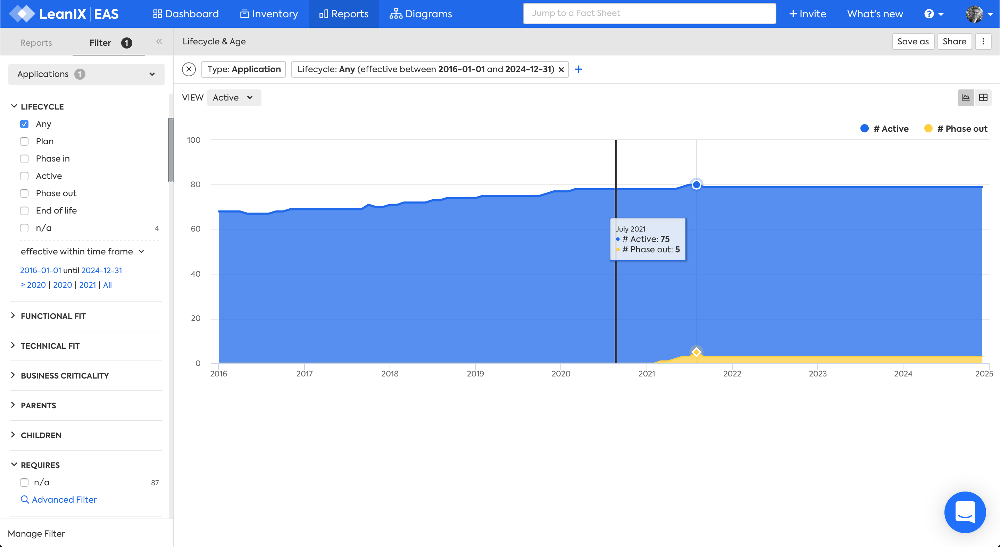
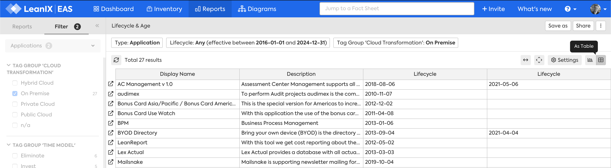

!!! note "Work in progress"

# Lifecycle and Age report

## Overview

The Lifecycle and Age report answers the questions:

>- How many applications are active or are being phased out each year?
>- How many applications became active each year?

{: .zoom }  

*Lifecycle and Age report, "Active" view, filtered by "On-Premise" tag.*

## Requirements

### Factsheets

The following factsheets and associated properties are required:

- Application
    - Lifecycle Active dates
    - Lifecycle Phase out dates

<!--
### Tags 

No tags are required for this report.

### Other requirement

No other requirements
-->

## Settings

Display this report as a chart or table. 

{: .zoom }  

## View

The views available are:

1. Active
1. Age Structure

## Filters

Use filters to focus on the required areas and timeframes.
 
<!--
## Editing

This report cannot be edited
-->
