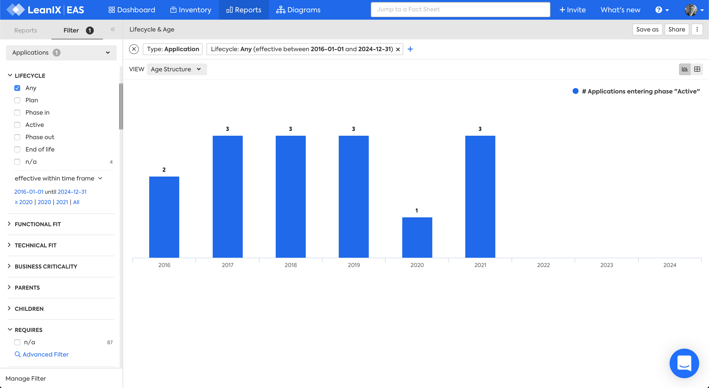

# Lifecycle and Age report

## Overview

The Lifecycle and Age report answers the questions:

>- How many applications are active or are being phased out each year?
>- How many applications became active each year?

  

*Lifecycle and Age report, "Active" view.*

## Requirements

### Factsheets

The following factsheets and associated properties are required:

- Application
    - Lifecycle Active dates
    - Lifecycle Phase out dates

<!--
### Tags 

No tags are required for this report.

### Other requirements

No other requirements
-->

## Settings

Display this report as a chart or table. 

  

## View

The views available are:

1. Active
1. Age Structure

  

*Lifecycle and Age report, "Age Structure" view.*

## Filters

[Use filters][report-filters] to focus on the required Applications

<!-- other links -->

[report-filters]: https://docs.leanix.net/docs/searching-and-filtering-functions-in-leanix#searching-in-reports
