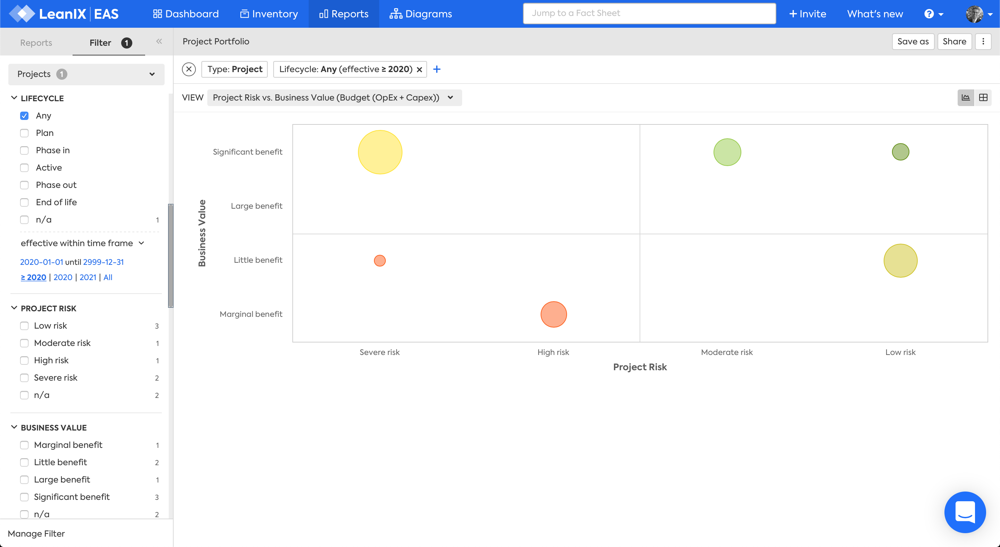
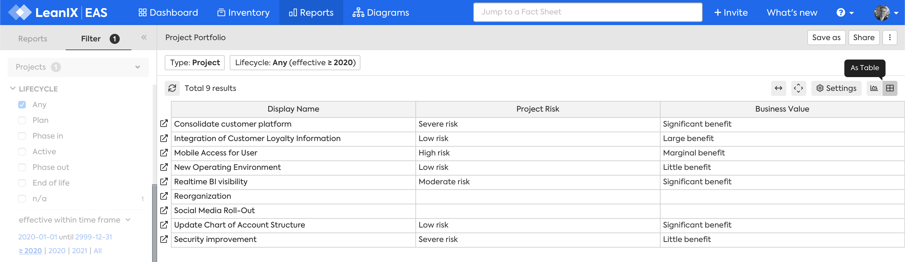

# Project Portfolio report
## Overview

The Project Portfolio report answers the question:

***[Which projects provide the highest value at the lowest risk?](../questions.md#projects)***

At risk projects with large budgets or delivering significant benefits may need closer management

*Project Portfolio report, Project Risk vs. Business Value (Budget (OpEx + Capex)) view.*

## Requirements

### Factsheets

The following factsheets and associated properties are required:

- Project
    - Project Risk 
    - OpEx (Budget) 
    - Capex (Budget)
    - Net Present Value (NPV)
 
<!--
### Tags 

No tags are required for this report.

### Other requirement

No other requirements
-->

## Settings

Display this report as a chart or table. 

## View

The views available are:

1. Project Risk vs. Business Value (Budget (OpEx + Capex))
1. Project Risk vs. Business Value (NPV)

## Filters

Use filters to focus on the required areas and timeframes.

<!--
#### Editing

This report cannot be edited
--> 
