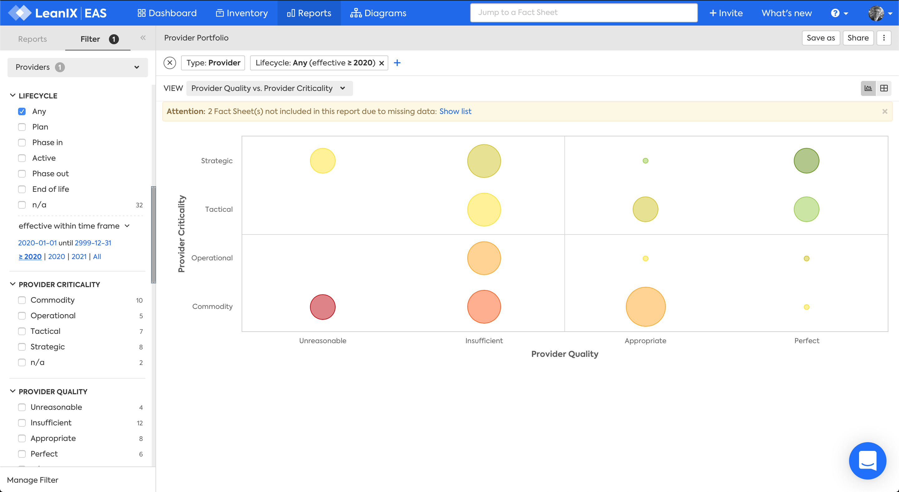
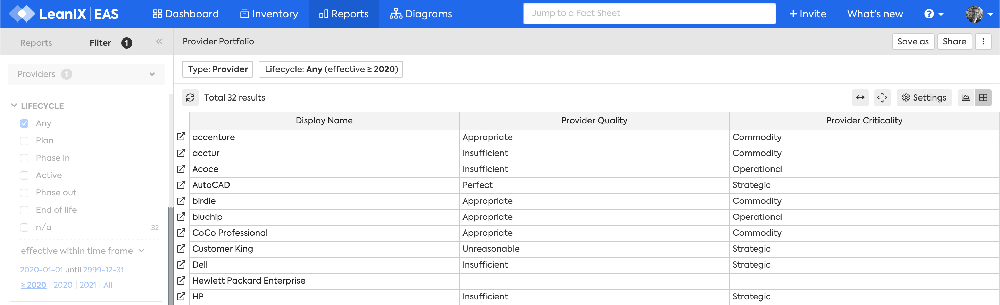

# Provider Portfolio report

## Overview

The Provider Portfolio report answers the question:

>Which provider relationships need closer management?

- Critical providers delivering low quality service may need closer management
- Expanding relationships with providers delivering high quality service could be considered

*Provider Portfolio report.*

## Requirements

### Factsheets

The following factsheets and associated properties are required:

- Provider
    - Provider Quality 
    - Provider Criticality 

<!--
### Tags 

No tags are required for this report.

### Other requirement

No other requirements
-->

## Settings

Display this report as a chart or table. 

## View

One view is available:

1. Provider Quality vs. Provider Criticality 

## Filters

Use filters to focus on the required areas and timeframes.

<!--
#### Editing

This report cannot be edited
--> 
