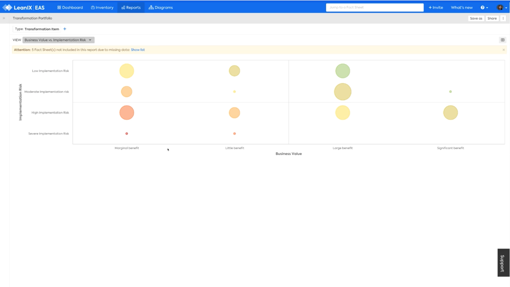

# Transformation Portfolio report
## Overview

The Transformation Portfolio report answers the question:

>Which Transformation items provide the highest value at the lowest risk?

At risk Transformation items with large budgets or delivering significant benefits may need closer management

  

*Transformation Portfolio report, Transformation Risk vs. Business Value (Budget (OpEx + Capex)) view.*

## Requirements

### Factsheets

The following factsheets and associated properties are required:

- Transformation
    - Transformation Risk 
    - OpEx (Budget) 
    - Capex (Budget)
    - Net Present Value (NPV)
 
<!--
### Tags 

No tags are required for this report.

### Other requirements

No other requirements
-->

## Settings

Display this report as a chart or table. 

<!--
  
-->

## View

The views available are:

1. Transformation Risk vs. Business Value (Budget (OpEx + Capex))
1. Transformation Risk vs. Business Value (NPV)

## Filters

[Use filters][report-filters] to focus on the required Transformation items
