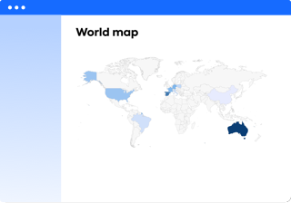

??? note "Work in progress"  
    - Images needed

Choose a report to discover the questions it can answer and how to re-create it using LeanIX.

The [Inventory][inventory] shows a table of factsheets and their properties.

[][inventory]

[Factsheet Map reports][factsheet-map] show a hierarchy of one factsheet type.

[][factsheet-map]

[Landscape reports][landscape] show one factsheet type within the hierarchy of another. 

[][landscape]

[Matrix reports][matrix] show one factsheet type within a matrix of other factsheet types or time.

[][matrix]

[Roadmap reports][roadmap] show the lifecycle of factsheets over time. 

[][roadmap]

The [Interface Circle Map][interface] shows a high-level view of interfaces between applications in the portfolio.

[][interface]

<!--
[Data Flow diagrams][data-flow] show interfaces between selected applications.

[][data-flow]
-->

[World Maps][location] show a geographic map of user group or IT component locations.

[][location]

[Cost reports][cost] total to costs associated with a business capability, project or provider.

[][cost]

[Portfolio reports][portfolio] show a grid of applications, projects or providers measured against two criteria.

[][portfolio]

[Lifecycle and Age reports][lifecycle-age] show the number of applications added or removed from the portfolio over time.

[][lifecycle-age]

<!-- leanix images
 
 

-->

<!-- links -->
[factsheet-map]: ../factsheet-map/ "Factsheet Maps"
[landscape]: ../landscape/ "Landscape reports"
[matrix]: ../matrix/ "Matrix reports"
[roadmap]: ../roadmap/ "Roadmap reports"
[location]: ../location/ "World maps"
[interface]: ../interface/ "Interface Circle Maps"
[data-flow]: ../interface/data-flow-diagram "Data Flow diagram"
[cost]: ../cost/ "Cost reports"
[lifecycle-age]: ../metrics/lifecycle-and-age-report "Lifecycle and Age reports"
[portfolio]: ../metrics/ "Portfolio reports"
[inventory]: ../inventory/ "Inventory"
