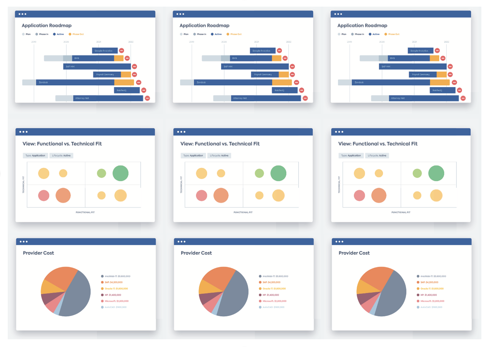

??? note "Design decision needed"
    - How should this be presented? Clickable images or a list? 
    - How should the report types be ordered? 
    
    Take inspiration for clickable images from the [Reshape your IT with 24 key Enterprise Architecture Views](https://www.leanix.net/en/download/reshape-your-it-with-24-key-enterprise-architecture-viewpoints) and [24 Key Enterprise Architecture Views for the Financial Services Industry](https://www.leanix.net/en/download/24-enterprise-architecture-views-financial-services)posters. Missing image for Factsheet Map report.

LeanIX provides many different ways to view and filter data to answer key questions. 

*Link to reports via thumbnail images. Image (c) 2020 Leanix from the [Reshape your IT with 24 key Enterprise Architecture Views](https://www.leanix.net/en/download/reshape-your-it-with-24-key-enterprise-architecture-viewpoints) poster* 

Link to reports via list: 

- [Landscape reports](landscape-reports/index.md) 
- [Matrix reports](matrix-reports/index.md) 
- [Roadmap reports](roadmap-reports/index.md) 
- [Metrics reports](metrics-reports/index.md)
- [Location reports](location-reports/index.md)
- [Interface reports](interface-reports/index.md)
- [Cost Analysis reports](cost-analysis-reports/index.md) 
- [Factsheet Map reports](factsheet-map-reports/index.md) 
