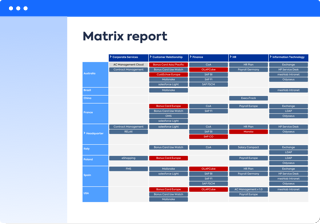

<!--
??? note "Work in progress"  
    - Images needed. Include report type in image so no caption is needed so you have a grid of images.
    - Take inspiration for clickable images from the [Reshape your IT with 24 key Enterprise Architecture Views](https://www.leanix.net/en/download/reshape-your-it-with-24-key-enterprise-architecture-viewpoints) and [24 Key Enterprise Architecture Views for the Financial Services Industry](https://www.leanix.net/en/download/24-enterprise-architecture-views-financial-services)posters. Missing image for Factsheet Map report.
-->

LeanIX provides many different ways to view and filter data to answer key questions. 

<!--
 
 

-->

<!-- Grid with text alt -->
[][factsheet-map]

[Factsheet Map reports][factsheet-map] show a hierarchy of one type of factsheet.

[][landscape]

[Landscape reports][landscape] show one type of factsheet within the hierarchy of another. 

[][matrix]

[Matrix reports][matrix] show one type of factsheet within a matrix of other factsheet types or time.

[][roadmap]

[Roadmap reports][roadmap] show the lifecycle of factsheets over time. 

[][interface]

The [Interface Circle Map][interface] shows a high-level view of interfaces between applications in the portfolio.

[][data-flow]

[Data Flow diagrams][data-flow] are drawn to show interfaces between selected applications.

[][location]

[Location reports][location] show a geographic map of where user groups or IT components are located.

[][cost]

[Cost reports][cost] total to costs associated with a business capability, project or provider.

[][portfolio]

[Portfolio reports][portfolio] show a grid of applications, projects or providers measured against two criteria.

[][lifecycle-age]

[Lifecycle and Age reports][lifecycle-age] show how applications are added or removed from the portfolio over time. 

[][inventory]

[Inventory reports][inventory] show a table of factsheets and their properties.

<!-- Grid of report images 

[][factsheet-map]
[][landscape]
[][matrix]
[][roadmap]
[][interface]
[][data-flow]
[][location]
[][cost]
[][portfolio]
[][lifecycle-age]
[][inventory]

-->

<!-- links -->
[factsheet-map]: factsheet-map/index.md "Factsheet Map reports"
[landscape]: landscape/index.md "Landscape reports"
[matrix]: matrix/index.md "Matrix reports"
[roadmap]: roadmap/index.md "Roadmap reports"
[location]: location/index.md "Location reports"
[interface]: interface/interface-circle-map-report.md "Interface Circle Map report"
[data-flow]: interface/data-flow-diagram.md "Data Flow diagram"
[cost]: cost/index.md "Cost reports"
[lifecycle-age]: metrics/lifecycle-and-age-report.md "Lifecycle and Age reports"
[portfolio]: metrics/index.md "Portfolio reports"
[inventory]: inventory/index.md "Inventory reports"
