!!! info "Work in Progress"

# Your Application Portfolio

## Welcome

In this initial meeting I'll walk you though how the Enterprise Architecture team has documented the Application Portfolio that supports your business area.

I'll start with how we've catalogued User Groups and Processes as these are used to provide context in the reports.

## Your User Groups

This report shows what User Groups are part of, or interact with, your business.

- External users are sub-divided into the channels they use.
- Internal users are based on the organisational structure; Divisions sub-divided into Business Units.

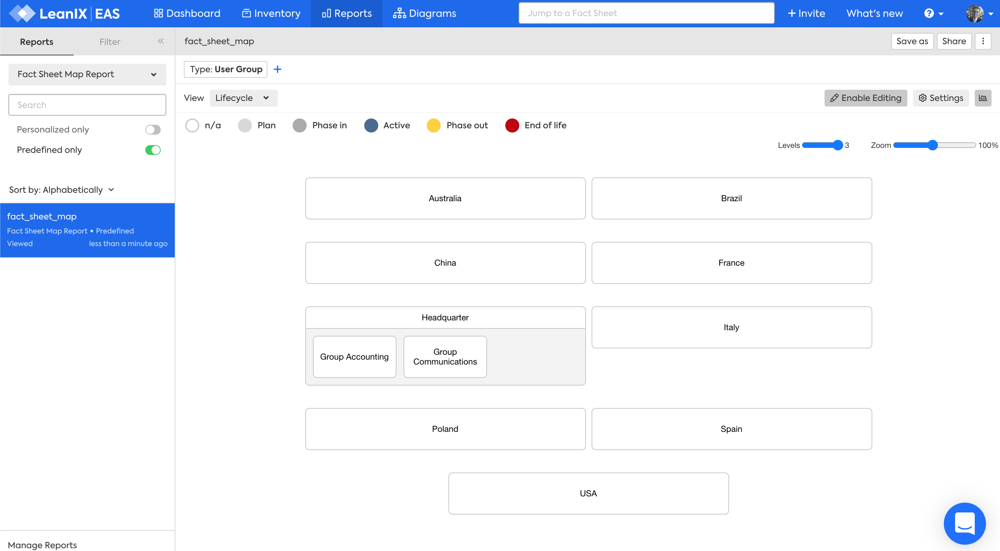 

## Your Processes

This report shows the Processes your business area participates in. We like to take a process view as it connects the value created to the member - [Inspiration](https://www.youtube.com/watch?v=C1FPQloVb54) :fontawesome-brands-youtube:{: .youtube }

We only capture high-level processes; some people call them "[value streams](https://en.wikipedia.org/wiki/Value_stream)". Other teams capture lower-level process diagrams.

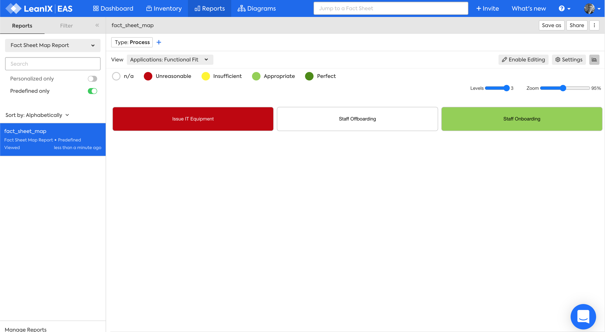

##  Applications supporting your Processes

This report shows which Applications support your processes. This view shows the lifecycle of each application.

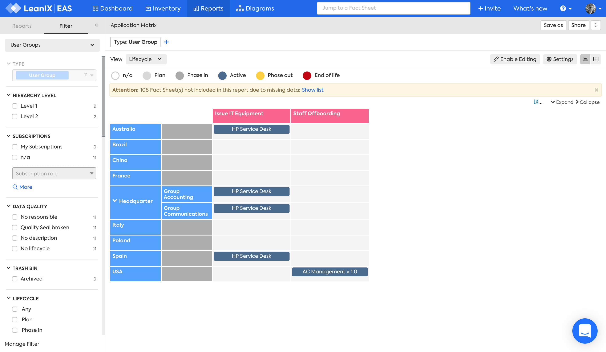 

There are many views that can be displayed. Do you have an area of interest?

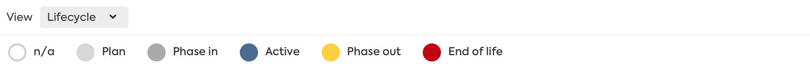

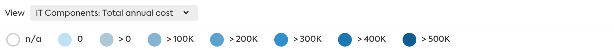

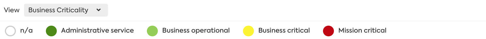

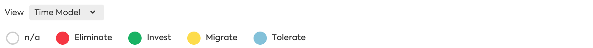

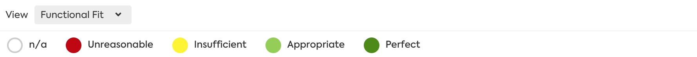

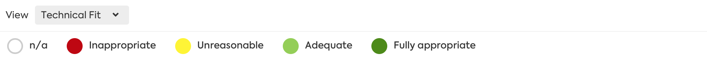

## Application portfolio health

This report provides an overview of the health (functional and technical fitness) of your applications in a grid. The quadrant the application is in determines it TIME classification (Tolerate, Invest, Migrate, Eliminate).

Technical Fit \\ Functional Fit | Low       | High
:------------------------------ | :-------- | :------
High                            | Tolerate  | Invest
Low                             | Eliminate | Migrate

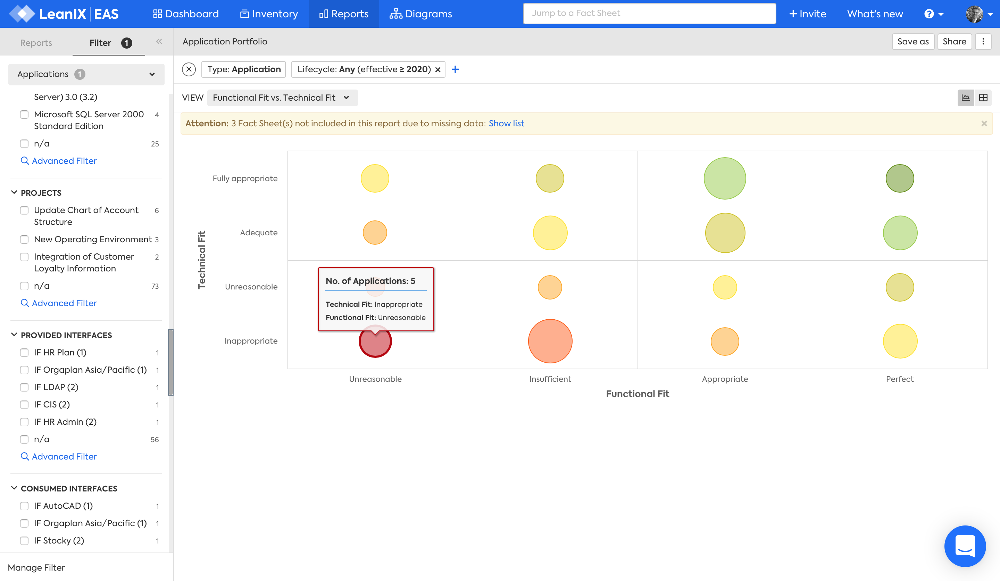

You can see which applications we recommend to eliminate.

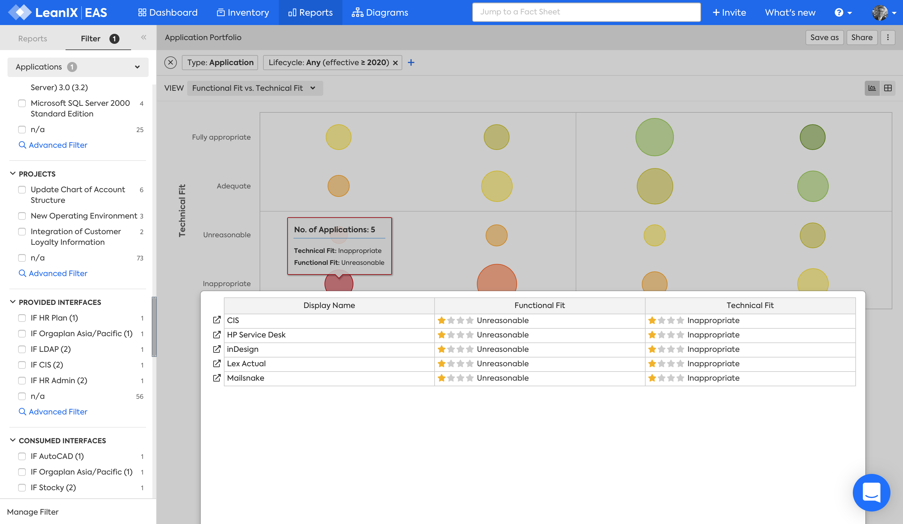

You can check if the application lifecycle aligns to the TIME recommendation using the Application Landscape report.

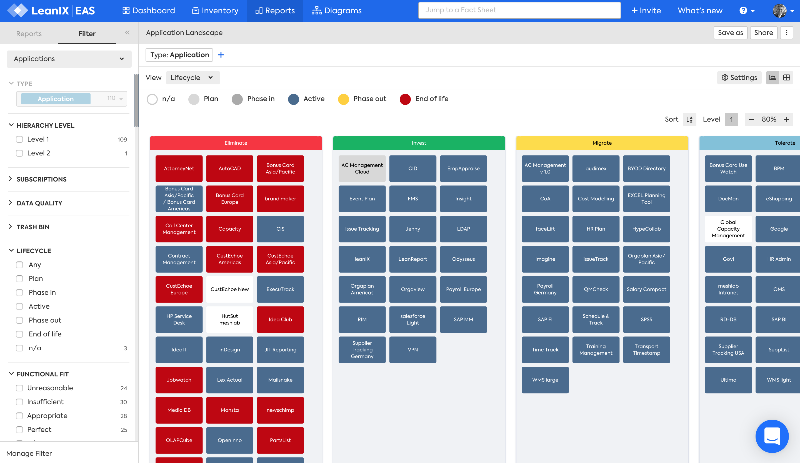

## Where next?

From here we can look at:

1. [Applications supporting your Business Capabilities](business-capability)
- [Projects changing your Application Portfolio](projects)
- Proposed changes to the Application Portfolio
- Data management, security and flows
- Providers supplying you IT services and applications
- [Your plans for the future](plans)

### Data Model

Our data model may help you understand the different types of questions the EA team could answer for you. 

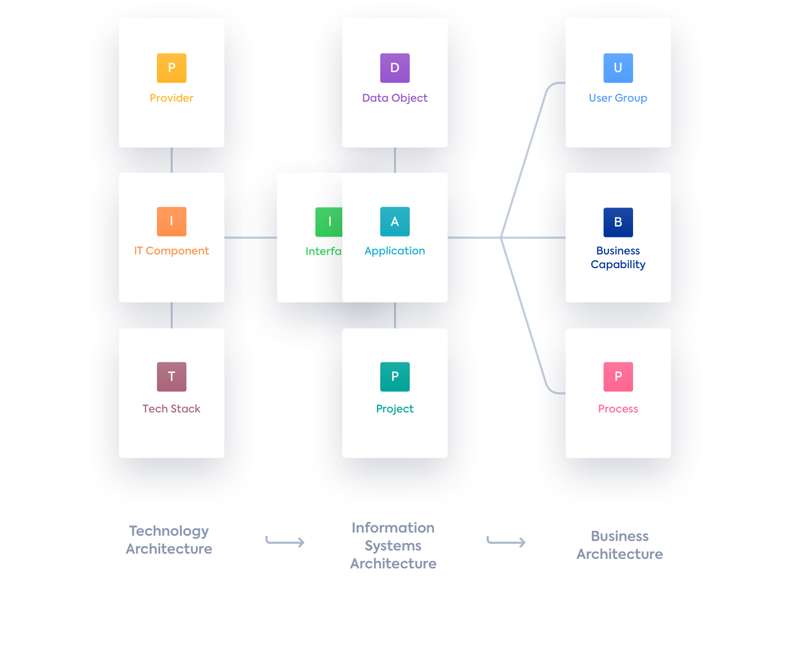
